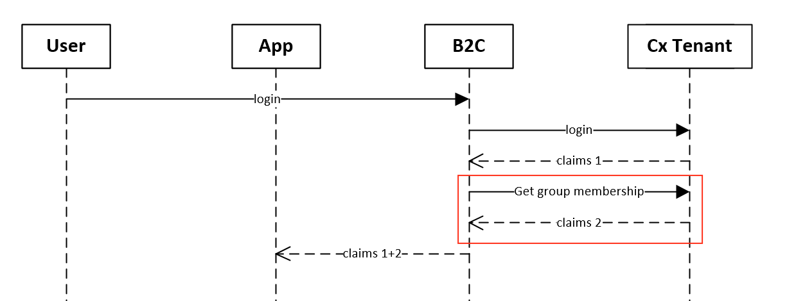
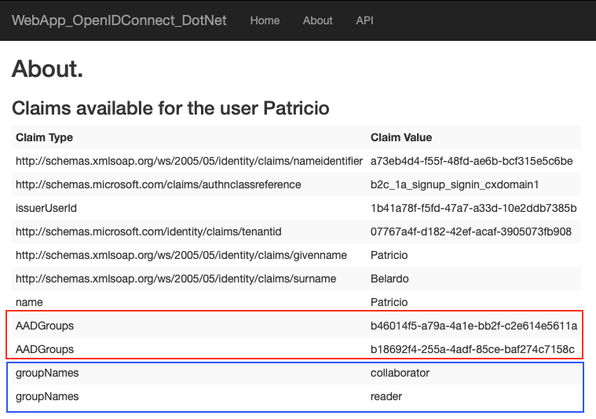

# B2C Proof of Concept
B2C PoC using additional steps to get group memberships at the IdP

Here is what we are doing here:



**Note**: This is not 100% accurate, but is to demostrate the additional step we are doing here

## Custom Policies

First, you should follow [this](https://docs.microsoft.com/en-us/azure/active-directory-b2c/active-directory-b2c-get-started-custom) process to use custom policies.

In these files you will see:
- pbcap.onmicrosoft.com: B2CTenant
- cxtenant1.onmicrosoft.com: An IdP (AAD) representing a customer tenant

> This approach is useful in case you are not receiving information about group memberships at the claim, or you are receiving just Ids. In case you want to enable B2C to include group membership at claims, with no additional steps, please refer to **Custom Policies (include group membership at claim)**

Basically the changes are:

### TrustFrameworkBase.xml

Added groupNames ClaimType
````xml
    <ClaimType Id="groupNames">
    <DisplayName>Collection with list of group names</DisplayName>
    <DataType>stringCollection</DataType>
    <UserInputType>Readonly</UserInputType>
    </ClaimType>
````
Added GetUserGroups TechnicalProfile
````xml
    <TechnicalProfile Id="GetUserGroups">
        <DisplayName>Retrieves security groups assigned to the user</DisplayName>
        <Protocol Name="Proprietary" Handler="Web.TPEngine.Providers.RestfulProvider, Web.TPEngine, Version=1.0.0.0, Culture=neutral, PublicKeyToken=null" />
        <Metadata>
        <Item Key="ServiceUrl">https://<yourlocation>/api/membership/groupnames</Item>
        <Item Key="AuthenticationType">None</Item>
        <Item Key="SendClaimsIn">QueryString</Item>
        <Item Key="AllowInsecureAuthInProduction">true</Item>
        </Metadata>
        <InputClaims>
        <InputClaim Required="true" ClaimTypeReferenceId="issuerUserId" />
        </InputClaims>
        <OutputClaims>
        <OutputClaim ClaimTypeReferenceId="groupNames" />
        </OutputClaims>
        <UseTechnicalProfileForSessionManagement ReferenceId="SM-Noop" />
    </TechnicalProfile>
````

### TrustFrameworkExtensions.xml

At one UserJourney, added an additional OrchestrationStep
````xml
         <OrchestrationStep Order="7" Type="ClaimsExchange">
          <ClaimsExchanges>
            <ClaimsExchange Id="GetUserGroups" TechnicalProfileReferenceId="GetUserGroups" />
          </ClaimsExchanges>
        </OrchestrationStep>
````

### SignUpOrSigninCxDomain1.xml

Added the groupNames outputclaim
````xml
<OutputClaim ClaimTypeReferenceId="groupNames" />
````

## Custom Policies (include group membership at claim)

This is an **optional** step. 

> If you are using AAD, you will need to change the app registration manifest to include group membership information, as explained [here](https://docs.microsoft.com/en-us/azure/active-directory/hybrid/how-to-connect-fed-group-claims#configure-the-azure-ad-application-registration-for-group-attributes)

In case you want to add the group membership you are receiving from your IdP as an output claim at B2C, you can do it changing the following files:

### TrustFrameworkBase.xml

Added 2 ClaimTypes
````xml
<ClaimType Id="groups">
  <DisplayName>Groups from AAD</DisplayName>
  <DataType>stringCollection</DataType>
</ClaimType>
 
<ClaimType Id="AADgroups">
  <DisplayName>Groups</DisplayName>
  <DataType>stringCollection</DataType>
</ClaimType>
````

### TrustFrameworkExtension.xml

At the TechnicalProfile located at the ClaimsProvider that points to your IdP, addded the following OutputClaims
````xml
<OutputClaim ClaimTypeReferenceId="AADGroups" PartnerClaimType="groups"/>
````

### SignUpOrSigninCxDomain1.xml

Added the AADGroups outputclaim
````xml
<OutputClaim ClaimTypeReferenceId="AADGroups" />
````

Now, your application that interacts with B2C will receive an AADGroups claim with groups information thet we god from the IdP.

## Membership information API

This is an Web API that uses Microsoft.Graph and will get group names based on a user membership (objectId).

> It is important to use the same parameter name as the name of the input parameter at the TechnicalProfile, in my case "issuerUserId"

Here is the principal method:

````c#
        [HttpGet("GroupNames")]
        public async Task<ActionResult<JObject>> GetMembership(string issuerUserId)
        {
            if (string.IsNullOrEmpty(issuerUserId))
            {
                return new JObject { "You must include a userid" };
            }
            AuthenticationConfig config = AuthenticationConfig.ReadFromJsonFile("appsettings.json");
            IConfidentialClientApplication app;
            app = ConfidentialClientApplicationBuilder.Create(config.ClientId)
                            .WithClientSecret(config.ClientSecret)
                            .WithAuthority(new Uri(config.Authority))
                            .Build();
            // With client credentials flows the scopes is ALWAYS of the shape "resource/.default", as the 
            // application permissions need to be set statically (in the portal or by PowerShell), and then granted by
            // a tenant administrator
            string[] scopes = new string[] { "https://graph.microsoft.com/.default" };
            JObject returnValue = new JObject();
            AuthenticationResult result = null;
            try
            {
                result = await app.AcquireTokenForClient(scopes)
                    .ExecuteAsync();
                Console.ForegroundColor = ConsoleColor.Green;
                Console.WriteLine("Token acquired");
                Console.ResetColor();
            }
            catch (MsalServiceException ex) when (ex.Message.Contains("AADSTS70011"))
            {
                // Invalid scope. The scope has to be of the form "https://resourceurl/.default"
                // Mitigation: change the scope to be as expected
                Console.ForegroundColor = ConsoleColor.Red;
                Console.WriteLine("Scope provided is not supported");
                Console.ResetColor();
            }

            if (result != null)
            {
                var httpClient = new HttpClient();
                var apiCaller = new ProtectedApiCallHelper(httpClient);
                returnValue = await apiCaller.CallWebApiASync($"https://graph.microsoft.com/v1.0/users/{issuerUserId}/memberOf", result.AccessToken);
            }

            var groupArray = (JArray)returnValue["value"];
            var groupNames = new List<string>();
            if (groupArray != null)
            {
                foreach (JObject g in groupArray)
                {
                    var name = g["displayName"].Value<string>();
                    groupNames.Add(name);
                }
            }
            return new JsonResult(
               new
               {
                   groupNames
               });
        }
````

## Results

Here are the claims I received after changes:




### Notes
You can use the [test](https://docs.microsoft.com/en-us/azure/active-directory-b2c/active-directory-b2c-get-started-custom#test-the-custom-policy) application at B2C. An additional resource with information about how to test it is located [here](https://saraford.net/2017/09/18/how-to-review-your-azure-ad-b2c-tokens-using-policy-run-now-and-jwt-ms/).

Another option is to use [this](https://github.com/Azure-Samples/active-directory-b2c-dotnetcore-webapp) application to see the claims output at the about page.

**Remember**. You can add [AppInsights](https://docs.microsoft.com/en-us/azure/active-directory-b2c/active-directory-b2c-troubleshoot-custom) traces for debugging!